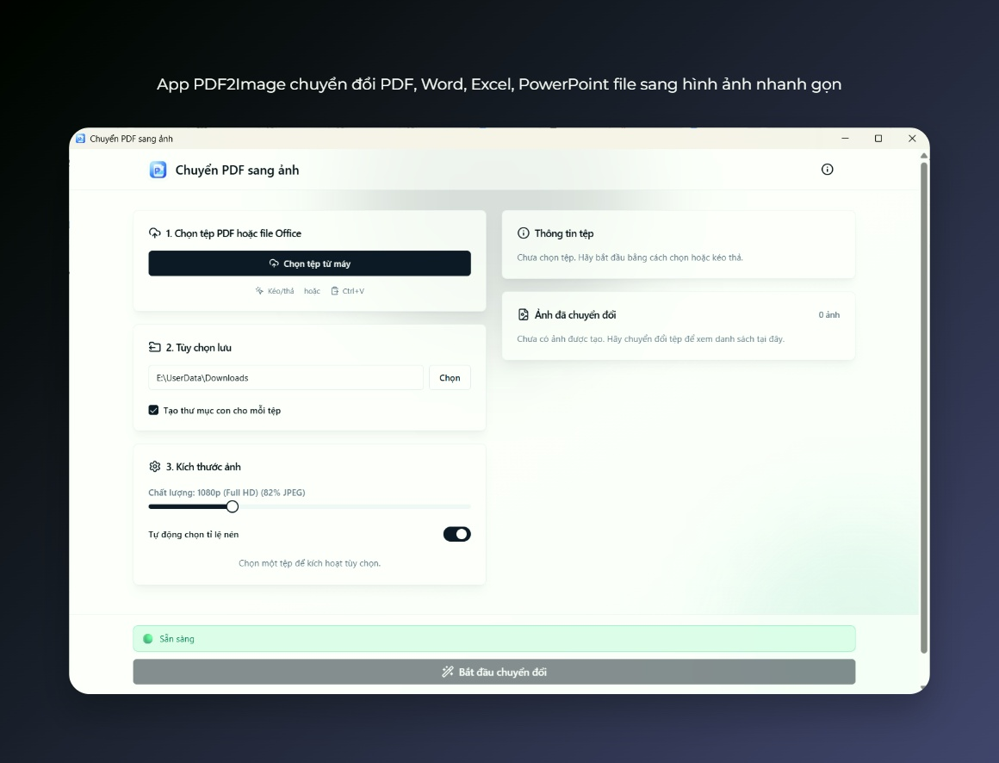

# PDF2Image – Trình cài đặt (Windows)

Ứng dụng PDF2Image giúp chuyển đổi nhanh các tệp PDF, Word, Excel, PowerPoint sang hình ảnh (PNG/JPG) một cách dễ dàng và ổn định.

---

## Mục lục

-   [Tính năng chính](#tính-năng-chính)
-   [Cài đặt](#cài-đặt)
-   [Sử dụng](#sử-dụng)
-   [Ảnh giao diện](#ảnh-giao-diện)
-   [Liên hệ & góp ý](#liên-hệ--góp-ý)

---

## Tính năng chính

-   Chuyển đổi PDF, Word, Excel, PowerPoint sang hình ảnh JPG.
-   Xử lý nhanh, giao diện đơn giản, dễ thao tác.
-   Tùy chọn chất lượng/DPI (nếu có trong ứng dụng) để tối ưu kích thước và độ nét.

## Cài đặt

1. Tải file cài đặt. (⚠️⚠️⚠️ LƯU Ý, ĐỐI VỚI CÀI ĐẶT LẦN ĐẦU THÌ CÁC BẠN HÃY TẢI FILE CÓ ĐUÔI .EXE (không phải .msi) ĐỂ TỰ ĐỘNG TẢI WEBVIEW2 NẾU CẦN THIẾT NHÉ)
2. Nhấp đúp để chạy trình cài đặt, chọn Next theo hướng dẫn.
3. Sau khi hoàn tất, mở ứng dụng PDF2Image từ Start Menu hoặc shortcut trên Desktop.

Lưu ý: Windows SmartScreen có thể hiển thị cảnh báo khi chạy file .msi. Hãy chọn “More info” → “Run anyway” nếu bạn tin tưởng nguồn tải (GitHub repo này).

## Sử dụng

1. Mở ứng dụng PDF2Image.
2. Kéo-thả hoặc bấm chọn tệp PDF/Word/Excel/PowerPoint cần chuyển.
3. Chọn định dạng ảnh (PNG/JPG) và các tùy chọn phù hợp (độ phân giải, thư mục lưu,... nếu có).
4. Nhấn “Chuyển đổi” (Convert) và chờ hoàn tất.
5. Mở thư mục đích để xem ảnh đã xuất.

## Ảnh giao diện

## Liên hệ & góp ý

-   Zalo: 0355872745

Nếu bạn thấy hữu ích, hãy gắn sao (Star) cho repo để ủng hộ dự án.
